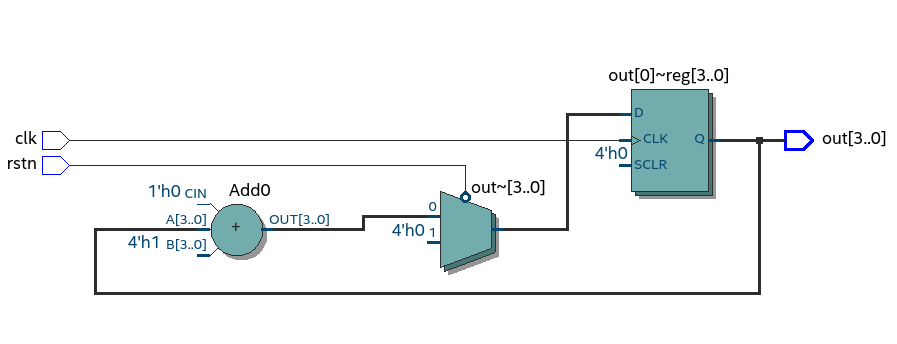

Video-da unutduğum bəzi məqamları bura qeyd edirəm:

52:00 dəqiqədə -
Ilk clock signal sequential componentə göndərilir. Daha sonra əgər reset pin high deyilsə Adder hissəsindən sequential komponentdən gələn output dəyəri bir artırılır və multiplexer vasitəsi ilə göndərilir yenidən sequential komponentə. Multiplexer selector pini burada gördüyünüz kimi əgər rstn 1 gələrsə (high volt) sadəcə D (Data) inputuna 0 göndərir. Əks halda isə Add0 komponentindən gələn dəyəri qəbul edib sequential komponetə göndərir.
